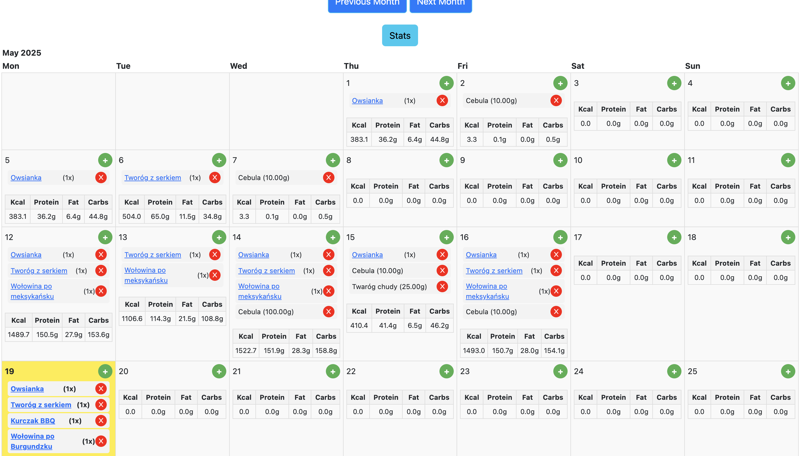

# KcalApp

**KcalApp** is a web application built with Django that helps users track calorie intake, manage recipes, and monitor dietary progress. The project allows users to log meals, calculate nutritional values, and plan their diets in a simple and intuitive way.

## 🧩 Features

- User registration and login
- Create and edit recipes with automatic nutritional value calculation
- Track daily calorie and macronutrient intake
- View progress with charts and statistics

## 🛠️ Technologies Used

- **Python 3.8+**
- **Django 3.2+**
- **HTML/CSS + Bootstrap** (for frontend templates)
- **JavaScript (HTMX)** for dynamic components
- **SQLite** as database engine
- **Django-Allauth** for authentication and user management
- **Chart.js or similar** for rendering statistics (if included)
- **Virtualenv** for dependency management

## 🚀 Installation

1. Clone the repository:

   ```bash
   git clone https://github.com/KubaWoj666/KcalApp.git
   cd KcalApp

   python -m venv venv
   source venv/bin/activate  # Linux/macOS
   venv\Scripts\activate     # Windows

   pip install -r requirements.txt

   python manage.py migrate

   python manage.py migrate

   python manage.py runserver
   ```

## 📁 Project Structure

- `core/` – main logic, views, and models
- `users/` – user accounts and authentication
- `stats/` – statistical analysis and chart generation
- `calenderApp` - Calendar view to log meals by day and automatically sum daily calories
- `templates/` – HTML templates
- `static/` – static files like CSS, JavaScript, images

## 📊 Sample Screenshots

### Home Page view

<p align="center">
  
  
</p>
    
<p align="center">
  
  
</p>

<p align="center">
  
  
</p>

<p align="center">
  
  
</p>

## 📬 Contact

For questions, feedback, or collaboration, reach out via [GitHub profile](https://github.com/KubaWoj666).
